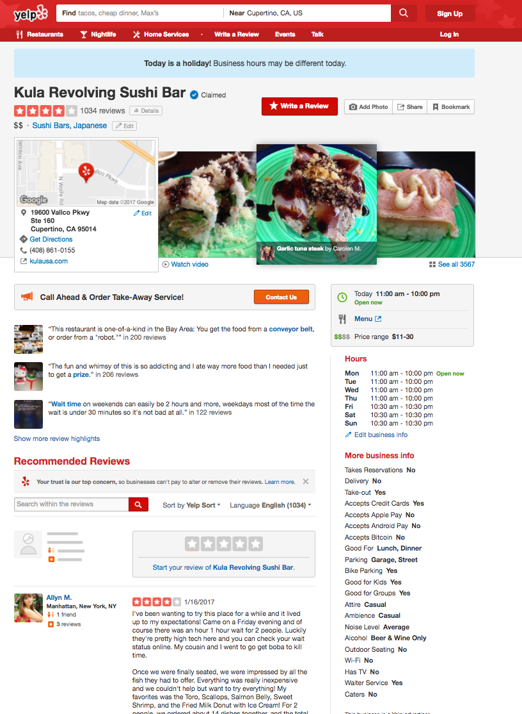

## Objective:
- Gather insights from yelp search result page and provide recommendations. 
----------------------------------------------------------
## Approach:
 -   rating over time
 -   break up rating into the key areas(service, food, ambience, etc.)
 -   look at distribution of ratings of restaurants, can we dd weight to the ratings such that low ratings from non credible users does not get same weightage as other ratings.
 -   see what people complain about for rating 1 vs rating 5
 -  what do people most like or dislike about a place. quick summary.

## Current Yelp Search Result page:

